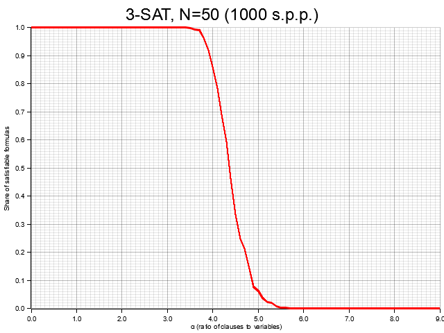
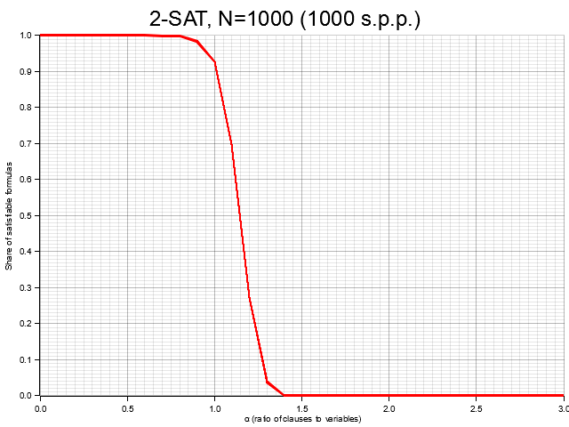

# Satisfaction
#### A Rust tool to investigate [phase transitions](https://en.wikipedia.org/wiki/Phase_transition) in [satisfiability problems](https://en.wikipedia.org/wiki/Boolean_satisfiability_problem).

**Satisfaction** combines a random generator of formulas in conjunctive normal form (*CNF*) with a custom *SAT solver* to generate plots of the share of satisfiable formulas for different values of $\alpha$ (the ratio of *clauses* to *variables*).

> I can't get no satisfaction  
> 'Cause I try and I try and I try and I try  
> — <cite>The Rolling Stones</cite>

### Examples

```console
satisfaction -k 3 -n 50 -s 1000
```



Here we see the transition, at $\alpha_C \approx 4.3$, for 3-SAT problems with $n = 50$ variables.

```console
satisfaction -k 2 -n 1000 -s 1000 --alpha-start 0 --alpha-end 3 --alpha-steps 30
```



In the case of 2-SAT, the solver algorithm is efficient and we can investigate sharper transitions like this one with $n = 1000$ variables.

### Help

```console
$ satisfaction --help

Investigate phase transition in k-SAT problems

Usage: satisfaction [OPTIONS]

Options:
  -k, --k <K>                      The number k of literals per clause (e.g. 3 for 3-SAT) [default: 3]
  -n, --n <N>                      The number n of available variables [default: 25]
  -s, --samples <SAMPLES>          The number of generated samples per point (s.p.p.) [default: 100]
      --alpha-start <ALPHA_START>  Lower bound for values of alpha [default: 0]
      --alpha-end <ALPHA_END>      Upper bound for values of alpha [default: 10]
      --alpha-steps <ALPHA_STEPS>  Number of values for alpha [default: 100]
      --verbose                    Verbosity (when turned on, the computed values are displayed)
  -h, --help                       Print help
  -V, --version                    Print version
```

### Resources

* *Computing Science: Can't Get No Satisfaction*, <https://www.jstor.org/stable/27856726>
* *Phase transitions and complexity in computer science: an overview of the statistical physics approach to the random satisfiability problem*, <https://www.phys.ens.psl.eu/~cocco/Articles/a14.pdf>
